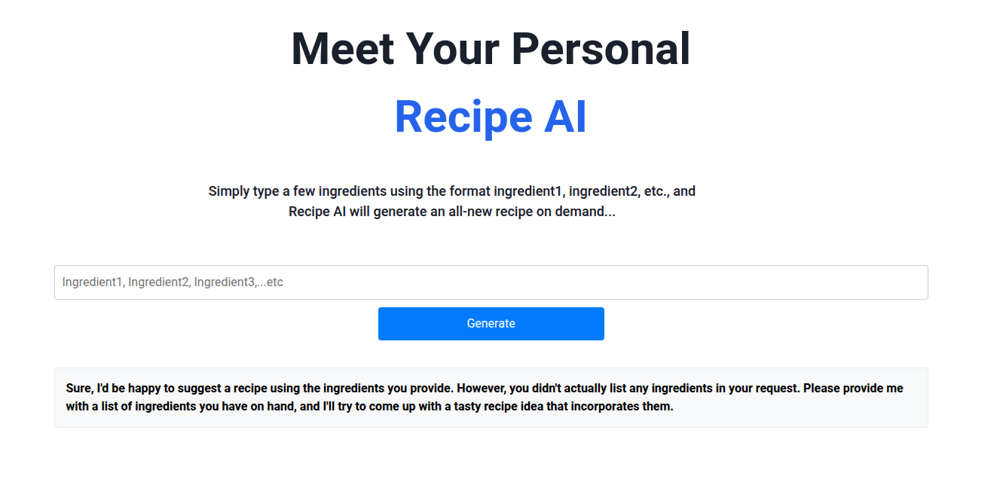
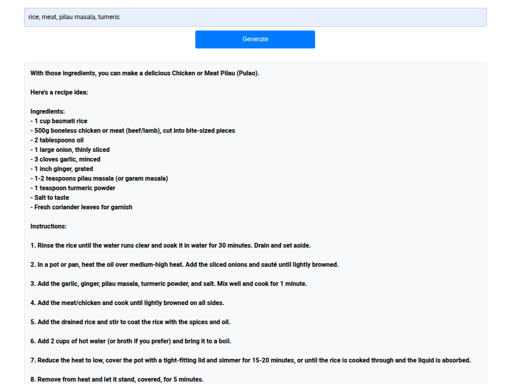

# AI Recipe Generator


## 🍽️ Overview

AI Recipe Generator is a modern web application that leverages the power of Claude 3 Sonnet on Amazon Bedrock to create personalized recipes based on user inputs. The application allows users to generate recipes by specifying ingredients, dietary restrictions, cuisine preferences, and meal types.

## ✨ Features

- **AI-Powered Recipe Generation**: Utilizes Claude 3 Sonnet on Amazon Bedrock to create unique, detailed recipes
- **Ingredient-Based Search**: Generate recipes based on available ingredients
- **Dietary Restriction Support**: Filter recipes by various dietary needs (vegan, gluten-free, keto, etc.)
- **Cuisine Selection**: Choose from a variety of global cuisines
- **Meal Type Filtering**: Find recipes for breakfast, lunch, dinner, or desserts
- **Responsive Design**: Fully responsive UI that works across all devices
- **Recipe Saving**: Save favorite recipes to user profiles
- **Print-Friendly Formatting**: Easy printing of recipes
- **Share Functionality**: Share recipes via social media or email

## 🛠️ Tech Stack

### Frontend
- **React 18** with **Vite** for fast development and optimized builds
- **TypeScript** for type safety and better developer experience
- **React Router** for client-side routing
- **React Query** for efficient data fetching
- **Styled Components** for component-based styling
- **Framer Motion** for smooth animations and transitions

### Backend & Infrastructure
- **AWS Amplify** for authentication, API, and hosting
- **Amazon Bedrock** providing access to Claude 3 Sonnet AI
- **AWS Lambda** for serverless computing
- **Amazon DynamoDB** for recipe and user data storage
- **AWS AppSync** for GraphQL API implementation

## 🚀 Deployment

The application is deployed and hosted on AWS Amplify, providing a scalable, reliable environment with continuous deployment from the GitHub repository.

**Live URL**: [ai-recipe-generator.example.com](https://main.d3oniozpkvmqys.amplifyapp.com/)

## 📷 Screenshots




## 🏗️ Architecture

```
┌────────────────┐       ┌───────────────────┐       ┌─────────────────┐
│                │       │                   │       │                 │
│  React App     │──────▶│  AWS Amplify API  │──────▶│  AWS Lambda     │
│                │       │                   │       │                 │
└────────────────┘       └───────────────────┘       └────────┬────────┘
                                                             │
                                                             ▼
                         ┌───────────────────┐       ┌─────────────────┐
                         │                   │       │                 │
                         │  Amazon DynamoDB  │◀──────│  Amazon Bedrock │
                         │                   │       │  (Claude 3)     │
                         └───────────────────┘       └─────────────────┘
```

## 🚦 Getting Started

### Prerequisites
- Node.js (v16 or higher)
- npm or yarn
- AWS account
- Amazon Bedrock access with Claude 3 Sonnet enabled

### Installation

1. Clone the repository
```bash
git clone https://github.com/yourusername/ai-recipe-generator.git
cd ai-recipe-generator
```

2. Install dependencies
```bash
npm install
# or
yarn install
```

3. Set up AWS Amplify
```bash
npm install -g @aws-amplify/cli
amplify configure
amplify init
```

4. Add necessary Amplify resources
```bash
amplify add auth
amplify add api
amplify add hosting
```

5. Deploy Amplify resources
```bash
amplify push
```

6. Start the development server
```bash
npm run dev
# or
yarn dev
```

## 💻 Development

### Key Implementation Details

#### Bedrock Integration
The application connects to Amazon Bedrock's Claude 3 Sonnet model using the AWS SDK. The recipe generation process involves:

1. Building a prompt based on user inputs
2. Sending the prompt to Claude 3 Sonnet via Amazon Bedrock
3. Parsing and formatting the response
4. Storing generated recipes in DynamoDB

#### Authentication Flow
User authentication is handled by AWS Amplify Auth, providing:
- Email/password authentication
- Social login options
- Multi-factor authentication
- User profile management

## 🧪 Testing

Run tests using the following command:
```bash
npm test
# or
yarn test
```

## 📝 License

This project is licensed under the MIT License - see the [LICENSE](LICENSE) file for details.

## 🙏 Acknowledgments

- Amazon Web Services for the comprehensive cloud infrastructure
- Anthropic for providing Claude 3 Sonnet through Amazon Bedrock
- The React and TypeScript communities for their excellent tools and documentation